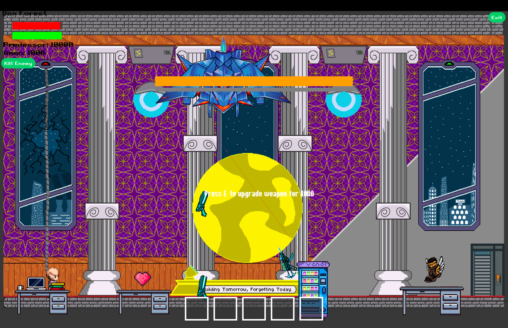

# Clash of Clankers
[](https://github.com/UQcsse3200/2025-studio-1/actions/workflows/game_release.yaml)
[](https://github.com/UQcsse3200/2025-studio-1/actions/workflows/game_tests.yaml)
[](https://github.com/UQcsse3200/2025-studio-1/actions/workflows/javadoc_build.yaml)

## Overview

**Clash of Clankers** is a game developed as part of the **Studio 1 course at The University of Queensland (UQ)**.
It is built on top of a custom game engine designed to support project-based learning in game development.

The project uses the [libGDX](https://libgdx.com/ "libGDX Information") framework and is written in **Java**.
The engine and game provide a structured yet creative environment where students design, implement, and polish real games across a semester.

You are welcome to explore, contribute, or adapt this project for your own learning or development purposes.


## Features
- Developed with **libGDX** for cross-platform support.
- Modular game engine architecture tailored for **team-based development**.
- Integrated **testing** and **SonarCloud quality assurance**.
- Includes **Clash of Clankers**, a playable game developed during Studio 1.


## Documentation and Reports
- [JavaDoc](https://uqcsse3200.github.io/2025-studio-1/)
- [SonarCloud Dashboard](https://sonarcloud.io/project/overview?id=UQcsse3200_2025-studio-1)

## Gameplay Preview

Here’s a look at **Clash of Clankers** in action:

<div style="text-align: center;">
  
</div>  

<div style="text-align: center;">
  
</div>  

<div style="text-align: center;">
  
</div>

> (Screenshots and GIF to be replaced with actual gameplay)*

## Getting Started
### Prerequisites

Ensure you have the following installed:
- [Java 17+](https://adoptium.net/)
- [Gradle](https://gradle.org/) (or use the included Gradle wrapper)
- A Java IDE such as [IntelliJ IDEA](https://www.jetbrains.com/idea/) or [Eclipse](https://www.eclipse.org/ide/)

---

### Installation

Clone the repository:

```bash
git clone https://github.com/UQcsse3200/2025-studio-1.git
cd 2025-studio-1
```

---

### Running the Game

Using Gradle wrapper:

```bash
./gradlew desktop:run
```

On Windows:

```bash
gradlew.bat desktop:run
```

---

### Building Distributables

To build a runnable JAR:

```bash
./gradlew desktop:dist
```

The JAR will be located in:

```
desktop/build/libs/
```

---

### Testing

Run the full test suite:

```bash
./gradlew test
```

View code coverage and reports:

```bash
./gradlew jacocoTestReport
```

---

## Contributing

Contributions are welcome. To ensure consistency across the project:

1. **Commit Messages**

   - Keep commit messages concise and descriptive.
   - Example:

      ```
      Add teleport cheat code to player system
      ```

2. **Pull Requests (PRs)**

   - Ensure your branch is up to date with `main`.
   - Include a clear description of the change and reference any relevant issue numbers.
   - Request at least one review before merging.

3. **Coding Standards**
   - Follow standard **Java conventions** and project-specific style rules.
   - Run tests (`./gradlew test`) and ensure code passes all checks before pushing.
   - Maintain high-quality documentation with Javadoc where appropriate.

## License
This project is licensed under the [MIT Licence](https://opensource.org/licenses/MIT).
You are free to use, modify, and distribute the code, provided that proper acknowledgment is given to the **Clash of Clankers team** and the **University of Queensland Studio 1 course**.

## Acknowledgments

- **The University of Queensland (UQ)** – for providing the Studio 1 framework and support.
- **libGDX** – the open-source game development framework powering this project.
- **Students and Contributors** – who collaboratively designed and built *Clash of Clankers*.